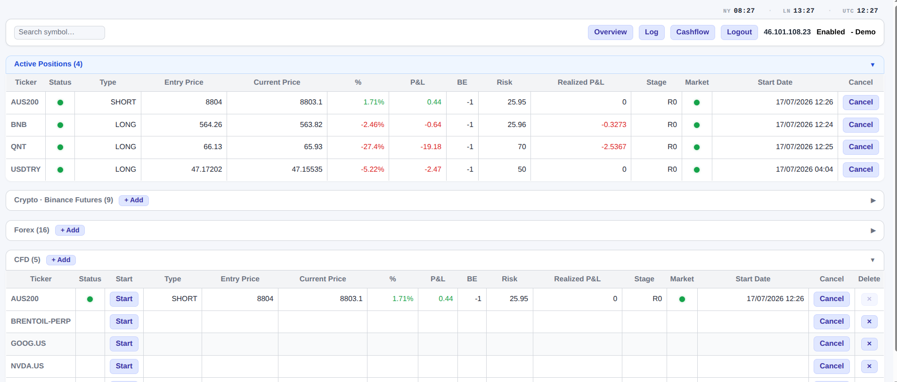
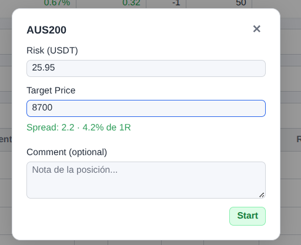
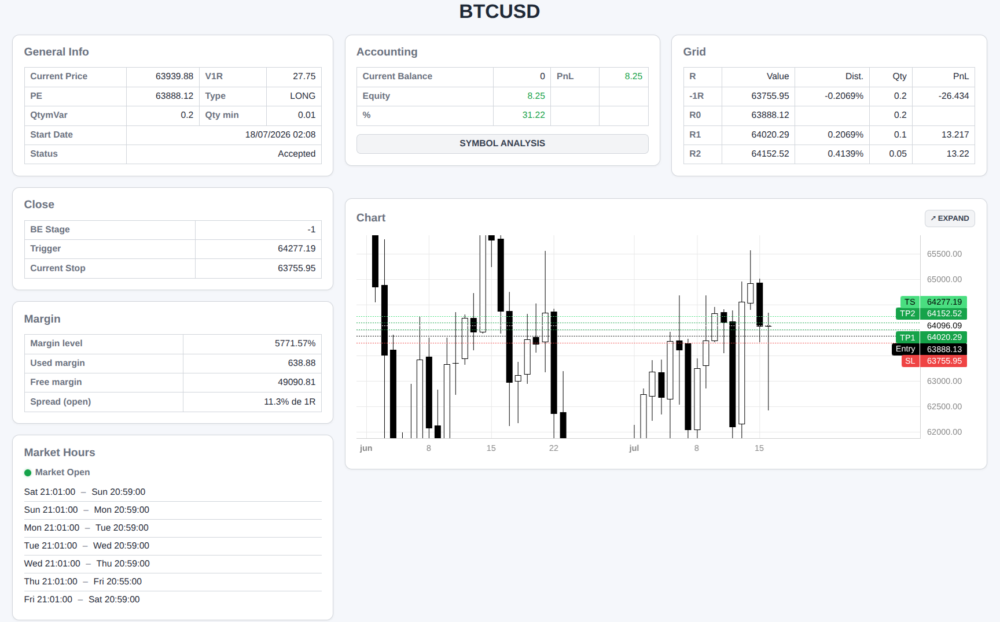
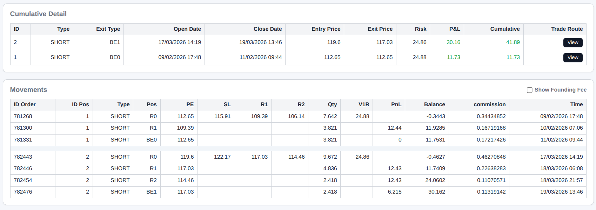
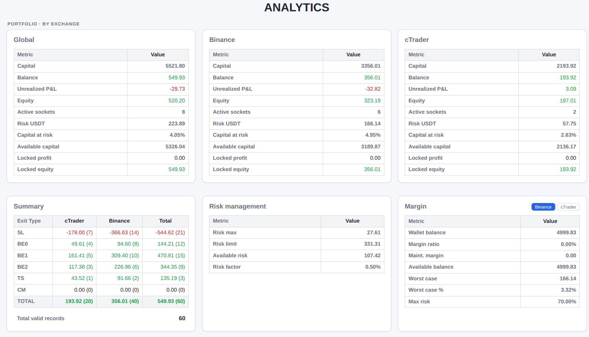
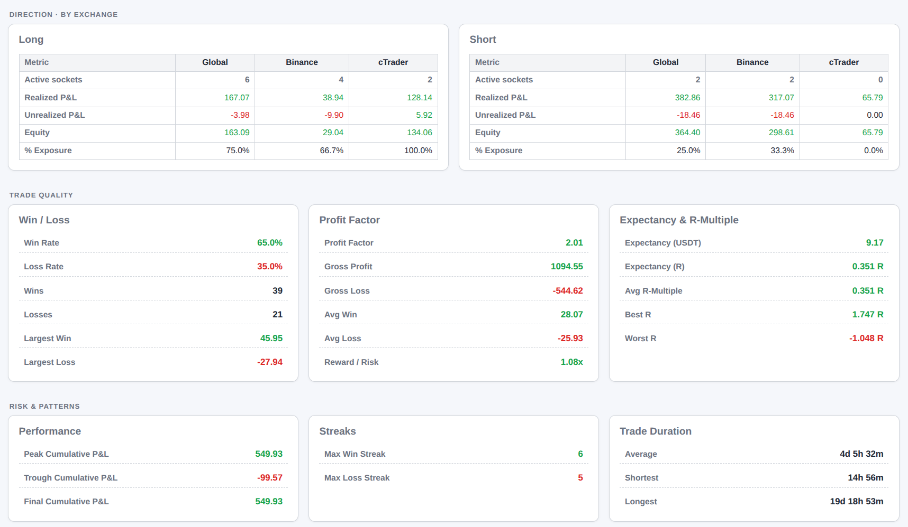
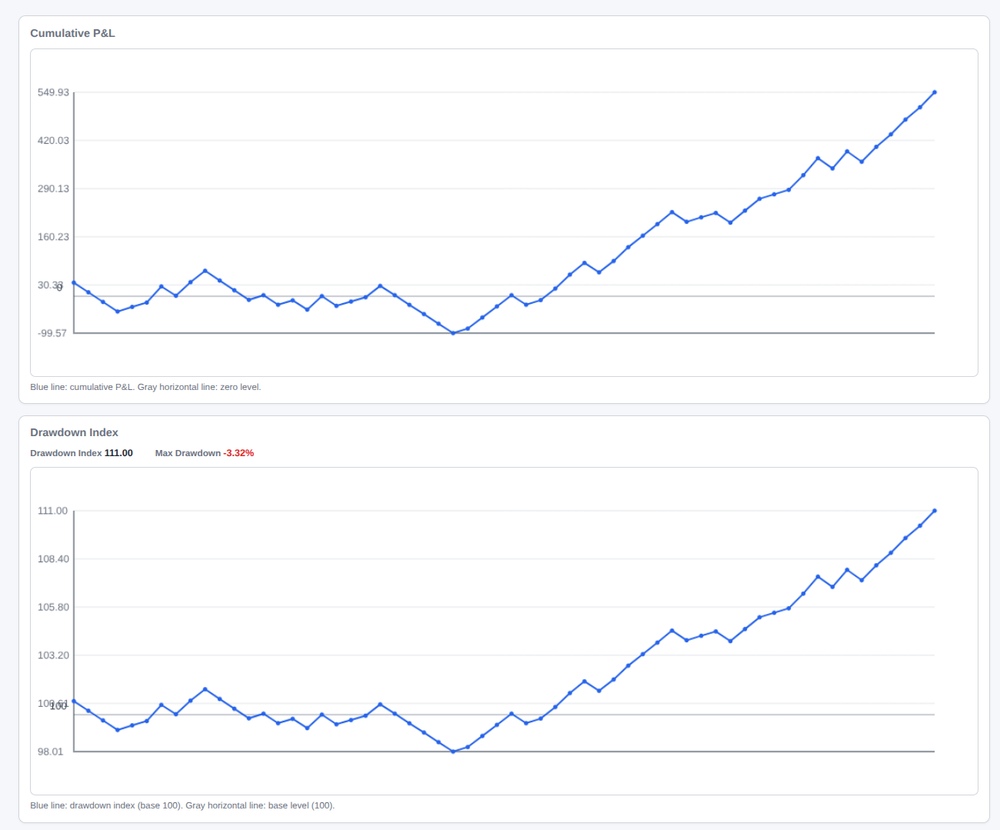
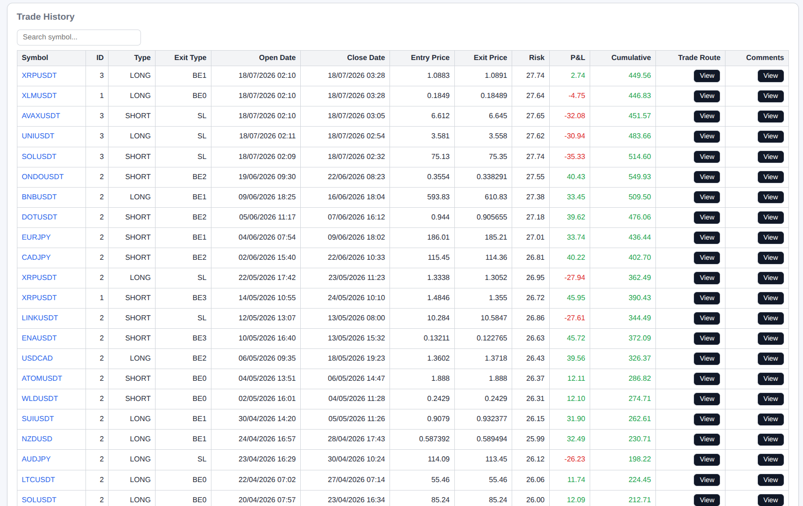
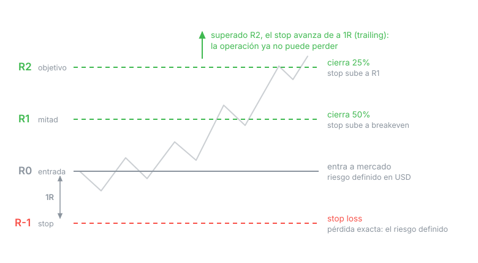
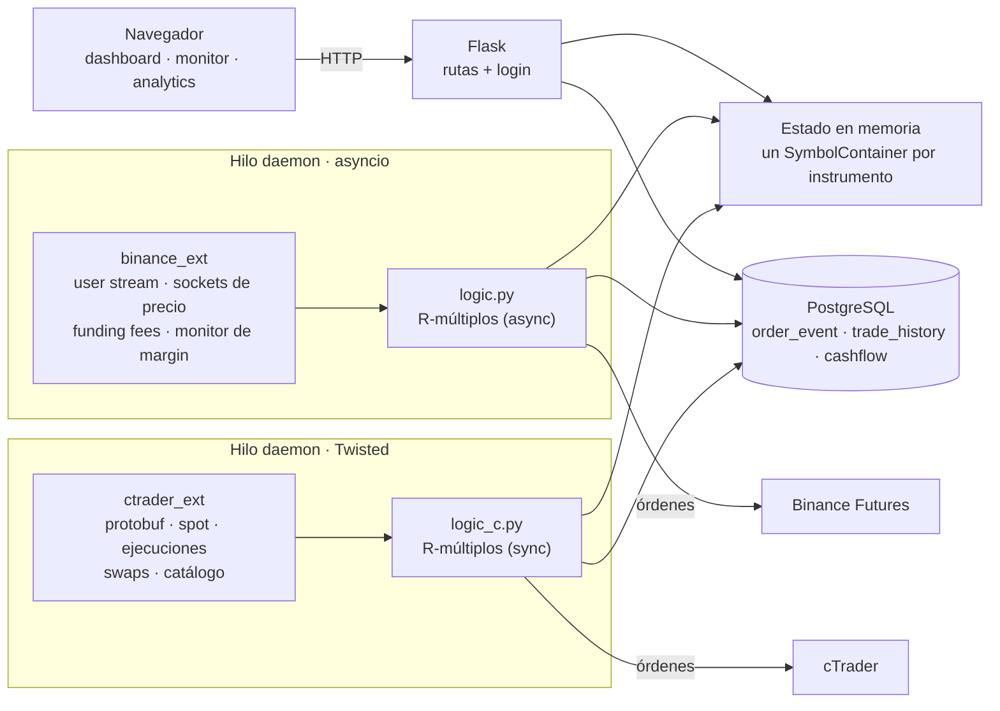

# Integral

**Gestor de posiciones de trading que opera Binance Futures y cTrader desde una sola interfaz, aplicando la misma estrategia de gestión de riesgo en ambos.**

Persigue dos objetivos a la vez: **automatizar la gestión de riesgo** de cada operación de punta a punta, y **llevar el registro contable** de todo lo que pasa en cada trade —evento por evento— para su posterior análisis.

Define el riesgo en dólares, no el tamaño de la posición. El sistema calcula la cantidad, coloca la entrada, deja el take profit y el stop loss puestos, mueve el stop a favor a medida que la posición avanza y registra cada evento en base de datos. Todo lo que a mano sería tedioso y propenso a error, hecho de forma consistente y en dos brokers con APIs completamente distintas. Y siempre de forma precavida: primero protege la posición y recién después registra, así la base refleja únicamente lo que de verdad ocurrió, nunca lo que se pretendía.

> **Lo desarrollé para gestionar mis propias posiciones.**
> Tener este proceso automatizado agiliza toda la administración de las posiciones: los cálculos y la
> gestión del riesgo los hace el sistema, y yo me concentro en la toma de decisiones.

### 🔗 Demo en vivo — **[int.zylestt.com](https://int.zylestt.com)**

> **Usuario:** `demo`  ·  **Contraseña:** `1234`

Instancia funcionando ahora mismo, conectada a cuentas demo de ambos brokers (Binance testnet y cTrader demo). Se puede recorrer el dashboard, el monitor de posiciones y los distintos análisis construidos a partir del historial registrado en la base de datos.

<!-- CAPTURA 1 — Dashboard principal (index.html) con el Panel de Control mostrando 2-3 posiciones activas.
     Guardar en: docs/img/dashboard.png -->


---

## El problema

Operar con gestión de riesgo real exige, en cada trade, calcular niveles, determinar el riesgo que se puede tomar y si la posición se adapta a él, colocar las órdenes de protección, moverlas cuando el precio avanza y llevar el registro para poder analizar después. Hacerlo a mano es lento y, sobre todo, inconsistente: la idea es eliminar el error humano y que cada operación se ejecute siempre bajo el mismo criterio.

El programa además se adapta a dos brokers con APIs distintas y varias diferencias estructurales entre sí:

| | Binance Futures | cTrader |
|---|---|---|
| Transporte | REST + WebSocket (JSON) | Open API (protobuf sobre TCP) |
| Concurrencia | `asyncio` | Reactor de Twisted |
| Respuestas | Síncronas, request/response | Fire-and-forget, todo llega como evento |
| Unidades | Cantidad en moneda base | Lotes, precios escalados ×100000 |
| Protección | Algo Order API (`algoId`) | SL sobre la posición + TP como órdenes límite |

**Integral aplica la misma estrategia sobre ambos**, con el modelo de estado, la lógica de riesgo, el registro y la interfaz compartidos. Solo el conector y el dialecto del algoritmo cambian por broker.

---

## Qué hace

- **Estrategia de R-múltiplos automatizada.** Se define un precio objetivo y el riesgo en USD; el sistema deriva los niveles, dimensiona la posición, entra a mercado y la deja protegida. Al abrir el modal de Start, el campo de riesgo ya viene precargado con el riesgo sugerido para el estado actual de la cuenta — se puede aceptar o sobreescribir.
- **Toma de ganancias parcial y stop progresivo.** Al tocar R1 cierra la mitad y mueve el stop a breakeven; al tocar R2 cierra un cuarto más y sube el stop a R1; el resto queda con trailing stop que avanza de a 1R.
- **Control de riesgo de cartera.** Antes de abrir simula el peor escenario — todas las posiciones abiertas tocando su stop a la vez — y bloquea la operación si el riesgo agregado supera el límite del balance real.
- **Capital variable según drawdown.** Un índice de drawdown reconstruido desde el historial reduce el riesgo por escalones: al 5% opera a la mitad, al 10% a un cuarto, al 15% deja de operar para revisar la estrategia utilizada. El riesgo sugerido en el Start ya incorpora este ajuste: en drawdown, la sugerencia baja sola.
- **Control de spread en cTrader.** No abre si el spread se ensanchó demasiado respecto de la distancia al stop.
- **Catálogo completo de ambos brokers.** El sistema descarga los catálogos enteros —absolutamente **todos** los símbolos de Binance Futures y **todos** los de la cuenta de cTrader a la que esté conectado, más de 2.000 entre cripto, forex y CFD— y cualquiera de ellos se puede sumar a las tablas del dashboard desde la interfaz, sin tocar código ni archivos de configuración.
- **P&L neto de verdad, no teórico.** El resultado de cada trade no es la diferencia de precio: se le descuentan las comisiones de entrada y salida, los *funding fees* de Binance (que se cobran tres veces por día) y el *swap* de cTrader por dejar la posición abierta a la noche. Cada uno de esos costos entra al balance cuando ocurre y queda registrado como un evento propio.
- **Registro completo de cada operación** — evento por evento y trade por trade — que habilita el análisis posterior y sienta la base para backtesting.
- **Analytics de calidad del sistema**, no solo de resultado: profit factor, expectancy y R-múltiplos, con desglose por broker, por dirección y por símbolo.

---

## Las tres pantallas

Abrir una posición es cargar dos datos: cuánto arriesgar y el precio objetivo. El riesgo ya viene sugerido según el estado de la cuenta, y en cTrader el modal muestra el spread del momento como porcentaje de 1R — el mismo dato que después puede bloquear la apertura si se dispara.



### Monitor de posición en vivo

Cada posición abierta tiene su pantalla: precio al segundo, grilla de niveles R con cantidad y P&L de cada uno, estado del stop (breakeven o trailing), horario de mercado y margin del broker.

El gráfico va **embebido y con los niveles dibujados sobre las velas** — entrada, TP1, TP2, stop y trailing como líneas de precio. En una sola imagen se ve dónde está el precio respecto de toda la estrategia, sin tener que cruzar números mentalmente.

Abajo, la tabla de **Movimientos** trae desde la base el historial completo de esa posición: la entrada, cada toma de ganancia, cada avance del stop, los funding fees, los swaps y el cierre — cada evento con su P&L, su comisión y el balance resultante. Es la trazabilidad de cómo se llegó al número final. Las filas de funding fee y swap arrancan ocultas detrás de un toggle: son ruido para la lectura diaria, pero están ahí cuando hay que auditar de dónde salió cada centavo.

<!-- CAPTURA 2 — Monitor de posición en vivo (main_loop.html) con una posición activa y el chart
     cargado mostrando las líneas Entry/TP1/TP2/SL. Guardar en: docs/img/monitor.png -->




### Analytics

Acá está la razón de registrar todo. La pantalla arranca con la foto de la cartera: capital, equity y P&L por broker, el resumen de salidas (cuántas cerraron en stop, en breakeven, en trailing) y el estado de riesgo y margin de cada cuenta.



Abajo están las métricas que responden si el sistema **funciona**, no solo cuánto dio:

| Grupo | Métricas |
|---|---|
| Calidad | Win rate, profit factor, gross profit / gross loss, ganancia y pérdida promedio, reward/risk, mayor ganancia y mayor pérdida |
| Expectancy | Expectancy en USDT y **en R**, R-múltiplo promedio, mejor y peor R |
| Riesgo y patrones | Pico, valle y P&L acumulado final, racha ganadora y perdedora máxima, duración de trades (promedio, mínima, máxima) |
| Desglose | Por exchange, por dirección (long/short) y por símbolo |



Los cierres manuales se excluyen de las métricas de calidad: no son una salida del algoritmo y ensuciarían la estadística. Siguen apareciendo en la curva y en el historial.

Dos gráficos cierran la pantalla: la **curva de P&L acumulado** y el **índice de drawdown** — que no es decorativo, es el mismo índice que dispara los escalones de riesgo. Ahí se ve cuándo el sistema se autolimitó y por qué.



Al pie está el **historial de operaciones**: una fila por trade cerrado, con símbolo, dirección, entrada y salida, resultado y la secuencia de eventos por la que pasó. Cada fila abre el detalle de su recorrido (cómo se llegó al resultado) y su comentario, editable ahí mismo. Es la lectura fina que hay detrás de todas las métricas de arriba.



---

## La estrategia en una imagen



**1R** es la distancia entre la entrada y el stop, y equivale a la mitad de la distancia al objetivo. La cantidad sale de dividir el riesgo por esa distancia, de modo que si el stop se ejecuta, la pérdida es exactamente la definida. Una vez que el precio supera R2, el trailing stop avanza de a 1R y la operación ya no puede terminar en pérdida.

---

## Arquitectura

Un proceso Flask y dos hilos daemon, uno por broker, porque cada API impone su propio modelo de concurrencia. Los tres comparten el estado en memoria y la base de datos.



**Estado por instrumento.** Cada símbolo tiene un contenedor con tres piezas que se llenan en momentos distintos del trade: lo que carga el usuario, lo que se fija al abrir (niveles, cantidades, precisión) y lo que se mueve tick a tick (precio, flags, P&L no realizado). Separarlas evita que un dato de entrada se pise con uno calculado, y hace que reiniciar un símbolo para el próximo trade sea una sola llamada.

**Dos implementaciones espejadas.** El algoritmo vive en `logic.py` (Binance, async) y `logic_c.py` (cTrader, sync). No están unificadas a propósito: la diferencia no es cosmética, es estructural. En Binance la apertura es una función; en cTrader hay que partirla en dos, porque el precio de entrada real solo se conoce cuando llega el evento de fill. Forzar una abstracción común habría escondido esa diferencia en vez de resolverla.

---

## Decisiones de diseño

Las que valen la pena contar, porque el código no las hace obvias.

### 1. Proteger primero, registrar después

Los take profit y el stop loss se colocan **antes** de escribir en la base de datos, nunca al revés. Si la base está caída, se pierde el registro y se avisa — pero jamás se deja una posición sin protección por un problema de registro.

El corolario está en el cierre: todo lo que toca la base va en un `try/except`, y la limpieza del broker (cancelar órdenes, cortar el feed, resetear el estado) va en un `finally`. Corre siempre.

### 2. Nunca sin stop, ni por un instante

En el trailing stop, el orden importa: **primero se coloca el stop nuevo y recién después se cancela el viejo.** Si la colocación falla, el stop anterior sigue vivo en el broker y la posición nunca queda descubierta; el próximo tick reintenta solo. Durante un instante conviven dos stops, lo cual es inocuo — a diferencia de la alternativa.

Por la misma razón, los niveles nuevos se calculan en variables locales y solo se escriben al estado una vez que el broker confirmó.

### 3. El riesgo se controla a nivel cartera, no a nivel trade

Que cada operación arriesgue lo definido no significa que el conjunto sea sostenible: diez posiciones bien dimensionadas pueden, todas juntas, acercar la cuenta a la liquidación. Antes de cada apertura el sistema simula el peor caso — todas las posiciones que todavía pueden perder tocan su stop a la vez, más la que se quiere abrir — descuenta la ganancia ya asegurada como colchón, y bloquea la operación si el total supera el 70% del balance real depositado en el broker, indicando cuánto habría que inyectar para habilitarla.

Acá el sistema distingue dos capitales que no son lo mismo. El **capital total** se administra vía cashflow (depósitos y retiros) más el resultado acumulado, y es la base sobre la que se calculan los montos de riesgo permitidos. El **balance depositado en cada broker** puede ser mucho menor: no hace falta tener todo el capital en la cuenta de futuros — se puede tener 5.000 de capital y solo unos cientos depositados. El control cruza los dos: el riesgo se dimensiona sobre el capital total, pero se verifica contra lo que de verdad hay en el broker, y si no alcanza, avisa cuánto transferir.

Los ingresos y retiros de capital se cargan como **movimientos de cashflow**, deliberadamente separados del resultado de los trades. Esa separación no es cosmética: ajusta el capital sobre el que se dimensiona el riesgo —meter o sacar plata cambia cuánto se puede arriesgar— sin ensuciar las métricas de rendimiento. Un depósito sube el capital pero no es una ganancia del sistema; contarlo como tal inflaría el P&L y distorsionaría profit factor, expectancy y la curva. Al vivir en su propia tabla, los indicadores miden solo lo que hizo la estrategia.

### 4. El drawdown como índice, no como monto absoluto

Los escalones de riesgo por drawdown (mitad al 5%, un cuarto al 10%, freno al 15%) se apoyan en un **índice**, no en una cifra en dólares. La decisión es deliberada, y la razón es la misma que separa el cashflow: el capital no es fijo, entran depósitos y salen retiros. Si el drawdown se midiera en dólares, cada movimiento de capital lo falsearía — un retiro se vería como una pérdida y un depósito taparía un drawdown real.

El índice se reconstruye componiendo el **retorno** de cada trade sobre el capital del momento, no su monto, así que no depende de cuánto capital haya en la cuenta. Meter o sacar plata no lo mueve; solo lo mueven los resultados de la estrategia. Así el sistema puede recibir ingresos y retiros de capital y aun así arrojar una medición de rendimiento consistente en el tiempo.

### 5. El spread como circuit breaker, no como filtro

El spread de apertura se captura fresco en el instante de abrir, y si supera el 25% de la distancia al stop, la operación se bloquea.

El umbral es alto **a propósito**. No está para filtrar decisiones normales: eso lo decide el usuario, que ve el spread en el modal antes de abrir. Está para atajar lo único que el usuario no puede ver — que el spread se ensanche entre el momento en que miró y el momento en que la orden se ejecuta, por un rollover, una noticia o falta de liquidez. Ese ensanche deja el stop pegado a la entrada y arruina la probabilidad del trade sin que nadie se entere. Distinguir un control de una restricción evita que la protección termine estorbando.

### 6. Fallar abierto, pero a conciencia

Los chequeos de margin y de spread **fallan abierto**: si el control no se puede evaluar por un problema de red, la operación se permite. Es deliberado. Un chequeo que no pudo correr no es evidencia de riesgo, y el broker rechaza igual por margen insuficiente. Fallar cerrado ante un error transitorio significaría bloquear operaciones válidas por una razón que no tiene nada que ver con el riesgo.

### 7. Todo en UTC

Las marcas de tiempo, los horarios de mercado, la programación de los funding fees (UTC 00:05 / 08:05 / 16:05) y cada registro en base de datos trabajan **siempre en UTC**, sin excepción. Unificar la zona horaria evita desfasajes entre los dos brokers, el servidor y la base: un trade se abre, se cierra y se mide sobre la misma referencia, corra donde corra la aplicación. Cualquier conversión a hora local se hace solo al mostrar, nunca al calcular o guardar.

### Otros controles

| Control | Qué resuelve |
|---|---|
| Ajuste por slippage | Los niveles R se recalculan sobre el precio de entrada real, no sobre el pedido. |
| Cierre de emergencia | Si la posición se abrió pero la protección falló, se cierra a mercado; si hasta eso falla, alerta para cerrar a mano. |
| Autolimitación de rate limit | Lee el peso consumido que informa Binance y saltea ciclos de polling al 75% del límite, para no arriesgar un bloqueo de IP. |
| Detección de stream colgado | Un socket sin datos por 5 minutos se reconecta: un stream vivo pero mudo es peor que uno caído. |
| Aislamiento de errores de orden | Un error al colocar una orden no mata el feed del símbolo; el siguiente tick reintenta. |
| Aislamiento de excepciones en cTrader | Una excepción procesando un evento tiraría la conexión TCP entera; van contenidas. |
| Re-suscripción tras reconexión | Las suscripciones de precio de cTrader son por conexión y se rehacen al re-autenticar. |
| Guards de estado (HTTP 409) | Rechaza abrir sobre una posición ya activa, o cerrar una que no existe. |
| Pre-chequeo de horario | No manda la orden si el mercado está cerrado, en vez de comerse el rechazo. |
| Verificación de remanente | Tras un cierre total, confirma que no quedó cantidad abierta y reintenta. |
| Cantidad mínima | Valida contra el mínimo del broker e informa el riesgo mínimo viable del instrumento. |
| Símbolo con posición activa | No se puede eliminar de la interfaz mientras opera. |
| Sin bloqueo del event loop | Toda llamada HTTP síncrona dentro de una corrutina va a un thread aparte. |
| Log en memoria | Ring buffer de 1000 líneas etiquetadas por nivel (INFO/WARNING/ERROR) y en UTC, con filtrado del ruido de requests; visible en `/log`, nada se escribe a disco. |

### Seguridad de la aplicación

| Control | Implementación |
|---|---|
| Autenticación | Guardián global: toda ruta nace protegida y la excepción es explícita (allowlist). Agregar una ruta nueva no puede exponerla por olvido. |
| Fuerza bruta | Backoff exponencial por IP (2^n segundos, tope 60) y registro de cada intento fallido. |
| Timing attacks | Comparación de credenciales en tiempo constante (`secrets.compare_digest`). |
| CSRF | Los endpoints que abren o cierran posiciones son POST: un link externo no puede disparar una operación con la sesión del usuario. |
| SQL injection | Todas las consultas parametrizadas, sin excepción. |
| Validación de entrada | Riesgo y precio objetivo se validan como números positivos antes de tocar el estado. |
| Firma de Binance | HMAC-SHA256 con ventana de recepción acotada. |
| Tokens de cTrader | El refresh token rota en cada renovación: se persiste fuera del `.env` y fuera del repositorio. |
| Secretos | Solo por variables de entorno. Nada hardcodeado. |

---

## Stack

| Capa | Tecnología |
|---|---|
| Backend | Python 3.11 · Flask |
| Concurrencia | `asyncio` (Binance) · Twisted (cTrader) · hilos daemon |
| Datos | PostgreSQL · `psycopg2` |
| Brokers | Binance Futures (REST + WebSocket) · cTrader Open API (protobuf) |
| Frontend | HTML · CSS · JavaScript sin framework · Lightweight Charts |
| Deploy | VPS con systemd |

---

## Instalación

Requiere Python 3.11+ y PostgreSQL.

```bash
git clone https://github.com/<usuario>/integral.git
cd integral
python -m venv venv && source venv/bin/activate
pip install -r requirements.txt

cp .env.example .env    # completar con las credenciales
python app.py
```

La aplicación levanta en el puerto definido en `PORT`. Las tablas se crean solas al arrancar.

### Configuración

Todas las credenciales van en `.env` (ver [`.env.example`](.env.example)). La variable **`DEMO`** es un switch único para ambos brokers: `true` usa Binance testnet y cTrader demo; `false`, las cuentas reales.

> ⚠️ En `.env` los comentarios van siempre en su propia línea. Bajo systemd con `EnvironmentFile`, un comentario al lado del valor pasa a formar parte del valor.

Los instrumentos activos viven en `symbols.json` y se administran desde la interfaz.

---

## Hacia dónde puede crecer

La separación entre conector y lógica hace que sumar un broker sea escribir un conector nuevo, no tocar la estrategia. El registro de operaciones, que hoy alimenta las métricas, es la misma base sobre la que correría un backtest.
